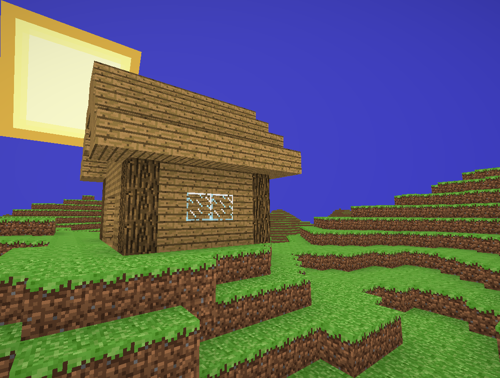
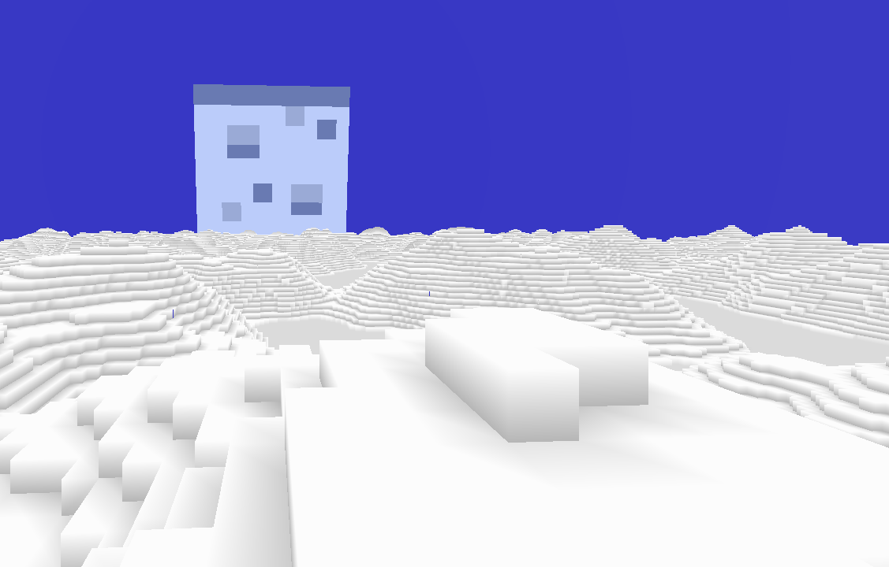
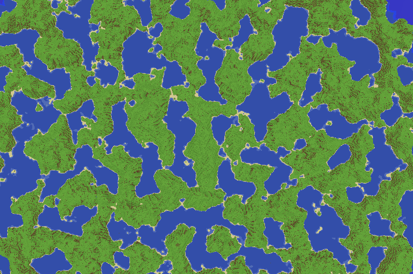
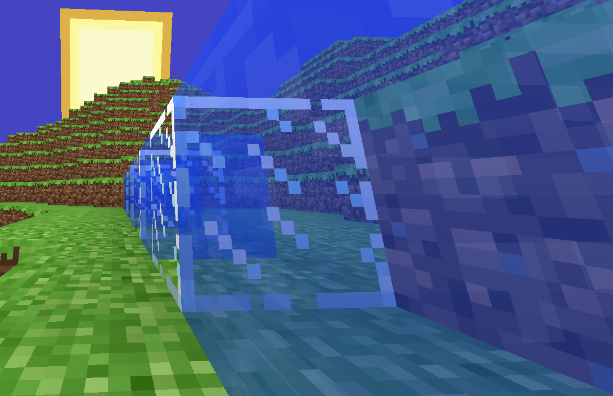
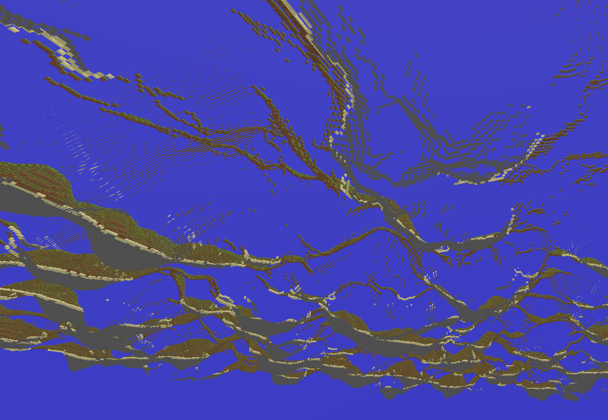

# glCraft

**A minecraft clone made with OpenGL, written in C++**

I am learning computer graphics, and the basics of game development. I think that the best way to learn something is to
use it to create a minecraft clone, so I made this, which is also my first C++ project. Making this was a great journey,
I learnt a lot. I created the game entirely from scratch except the libraries, compilers, the operating system and other
software that I used to make this.

## Screenshots

- Building and destroying blocks  
  
- Ambient Occlusion  
  
- Post-processing effects  
  
- Procedural world generation  
  
- Semi-transparent blocks  
  
- Order-Independent Transparency mode  
  
- The chunks are hollow on the inside  
  

## Building the project

- How to build it in CLion
  - 
    - Clone the repository
  ```shell
  git clone --recursive https://github.com/Isti01/glCraft.git
  ```

    - Open it in CLion and press the green magic button.

- How to build it using CMake
  - 
    - Clone the repository
  ```shell
  git clone --recursive https://github.com/Isti01/glCraft.git
  ```

    - Build the project *the build_type can be either Release or Debug*
  ```shell
  cd glCraft
  mkdir build
  cd build
  cmake -DCMAKE_BUILD_TYPE=<build_type> ..
  cmake --build .
  ```

    - Run the game on Linux *with an optional save to load*:
  ```shell
  ./main <saved-world.glc>
  ```

    - Or on Windows *with an optional save to load*
  ```batch
  main.exe <saved-world.glc>
  ```

## Features

- Rendering
  - 
    - The chunks are hollow on the inside, so most of the blocks that are not visible are not sent to the GPU.
    - Each vertex in a chunk is only 4 bytes long to make the game as memory-efficient as possible (on the GPU side).
    - The game has animated textures and an animated skybox.
    - The game supports ambient occlusion, post-processing and semi-transparent textures, the chunk meshes are sorted before drawing.
    - The world rendering has order independent transparency rendering mode implemented from
      this [paper](https://jcgt.org/published/0002/02/09/).
- Gameplay
  - 
    - The game has very basic, minecraft-like physics, with two movement modes:
        - One that is similar to spectator mode (the default).
        - One that is similar to the movement in survival.
    - The game has block placing, block picking and block breaking. - *maybe the most essential feature*
    - Implemented a basic UI to change the active block, load saves, and load custom textures for the world.
    - The world is generated procedurally using a seed, and loaded dynamically as the player moves across it.

- Controls
  -
    - `Left Click` to break a block
    - `Middle Click` to pick a block
    - `Right Click` to place a block
    - `WASD`  to move around
    - `Shift` to descend when physics is off
    - `Space` to ascend when physics is off, or jump when physics is on
    - `Ctrl` to go faster
    - `Esc` to open the menu

## Libraries that I used

- [FastNoiseLite](https://github.com/Auburn/FastNoiseLite) - for terrain generation
- [GLAD](https://github.com/Dav1dde/glad) - for loading OpenGL functions
- [glfw](https://github.com/glfw/glfw) - for managing the window
- [glm](https://github.com/g-truc/glm) - a great math library for working with OpenGL
- [imgui](https://github.com/ocornut/imgui) - for creating the amazing UI in the game
- [lodepng](https://github.com/lvandeve/lodepng) - for loading PNG textures
